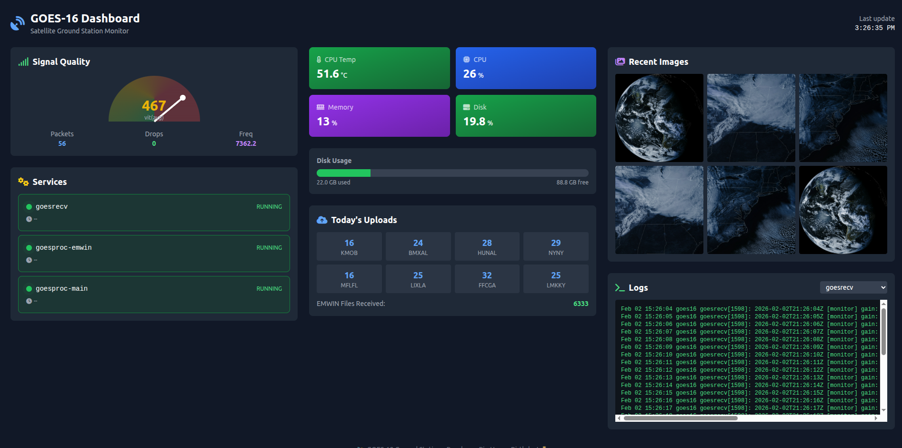
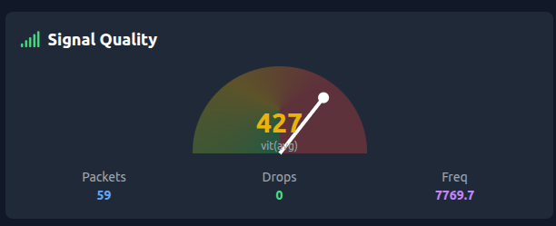
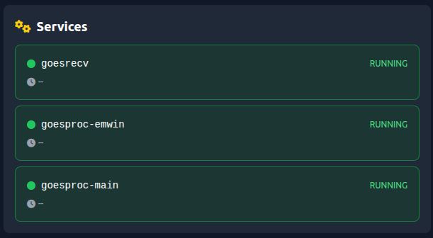
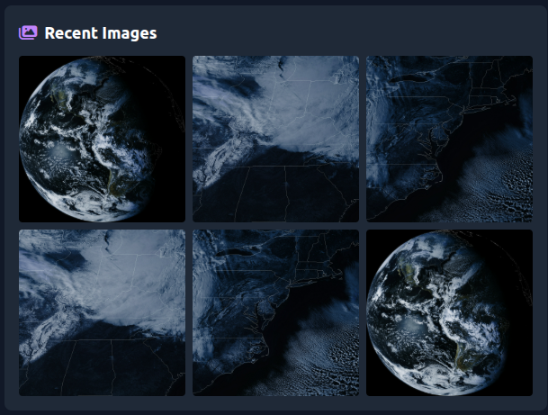

# 🛰️ GOES Satellite Dashboard

A beautiful, real-time web dashboard for monitoring your GOES satellite ground station running [goestools](https://github.com/pietern/goestools).



## Features

- **📡 Live Signal Monitoring** - Real-time viterbi, packet count, drops, and frequency deviation
- **⚙️ Service Status** - Monitor goesrecv and goesproc services with uptime and memory usage
- **📊 System Health** - CPU temperature, memory, disk usage, and load averages
- **☁️ Upload Statistics** - Track files uploaded to S3 by weather station
- **🖼️ Image Gallery** - Browse recent satellite images with lightbox viewer
- **📜 Live Logs** - Tail logs from any service in real-time
- **🔄 Auto-Refresh** - Updates every 5 seconds

## Screenshots

<p align="center">
  
  
  
</p>

## Requirements

- Raspberry Pi (3B+ or newer recommended)
- [goestools](https://github.com/pietern/goestools) installed and configured
- Python 3.9+
- systemd (standard on Raspberry Pi OS)

## Quick Install

```bash
# Clone the repository
git clone https://github.com/YOUR_USERNAME/goes-dashboard.git
cd goes-dashboard

# Run the installer
chmod +x install.sh
./install.sh
```

The dashboard will be available at `http://YOUR_PI_IP:8080`

## Manual Installation

```bash
# Install dependencies
pip3 install fastapi uvicorn psutil --break-system-packages

# Create installation directory
sudo mkdir -p /opt/goes-dashboard
sudo cp -r src/* /opt/goes-dashboard/
sudo cp config.example.json /opt/goes-dashboard/config.json

# Edit configuration for your setup
sudo nano /opt/goes-dashboard/config.json

# Install systemd service
sudo cp goes-dashboard.service /etc/systemd/system/
sudo systemctl daemon-reload
sudo systemctl enable goes-dashboard
sudo systemctl start goes-dashboard
```

## Configuration

Copy `config.example.json` to `config.json` and edit for your setup:

```json
{
  "satellite": "GOES-16",
  "data_dir": "/home/pi/goes16",
  "images_dir": "/home/pi/goes16",
  "emwin_dir": "/home/pi/goes16/emwinTEXT/emwin",
  "upload_logs_dir": "/home/pi",
  "services": {
    "receiver": "goesrecv",
    "processors": ["goesproc-emwin", "goesproc-main"]
  },
  "upload_stations": ["kmob", "bmxal", "hunal", "nyny", "mflfl", "lixla", "ffcga", "lmkky"],
  "dashboard_port": 8080,
  "refresh_interval": 5000
}
```

### Configuration Options

| Option | Description | Default |
|--------|-------------|---------|
| `satellite` | Satellite name (for display) | `GOES-16` |
| `data_dir` | Base directory for satellite data | `/home/pi/goes16` |
| `images_dir` | Directory containing satellite images | `/home/pi/goes16` |
| `emwin_dir` | EMWIN text files directory | `/home/pi/goes16/emwinTEXT/emwin` |
| `upload_logs_dir` | Directory containing upload logs | `/home/pi` |
| `services.receiver` | Name of goesrecv systemd service | `goesrecv` |
| `services.processors` | List of goesproc service names | `["goesproc"]` |
| `upload_stations` | List of weather stations to track | `[]` |
| `dashboard_port` | Port for web dashboard | `8080` |
| `refresh_interval` | Auto-refresh interval in ms | `5000` |

## Supported Configurations

This dashboard works with various goestools setups:

### GOES-16 (GOES-East)
```json
{
  "satellite": "GOES-16",
  "data_dir": "/home/pi/goes16"
}
```

### GOES-18 (GOES-West)
```json
{
  "satellite": "GOES-18",
  "data_dir": "/home/pi/goes18"
}
```

### GOES-19
```json
{
  "satellite": "GOES-19",
  "data_dir": "/home/pi/goes19"
}
```

### Custom Service Names

If your systemd services have different names:

```json
{
  "services": {
    "receiver": "goesrecv",
    "processors": ["goesproc-images", "goesproc-emwin", "goesproc-text"]
  }
}
```

## API Endpoints

The dashboard exposes a REST API you can use for your own integrations:

| Endpoint | Description |
|----------|-------------|
| `GET /api/signal` | Current signal statistics |
| `GET /api/services` | Service status and health |
| `GET /api/disk` | Disk usage information |
| `GET /api/system` | System metrics (CPU, memory, temp) |
| `GET /api/uploads` | Today's upload statistics |
| `GET /api/images?limit=10` | Recent satellite images |
| `GET /api/logs/{service}?lines=50` | Service log entries |
| `GET /api/health` | Health check endpoint |

### Example API Response

```bash
curl http://localhost:8080/api/signal
```

```json
{
  "gain": 35.1,
  "freq": -1303.6,
  "omega": 1.0,
  "vit_avg": 362,
  "drops": 0,
  "packets": 58,
  "status": "good",
  "timestamp": "2024-02-02T16:30:00"
}
```

## Troubleshooting

### Dashboard won't start

```bash
# Check service status
sudo systemctl status goes-dashboard

# View logs
journalctl -u goes-dashboard -f

# Test manually
cd /opt/goes-dashboard
python3 -m uvicorn main:app --host 0.0.0.0 --port 8080
```

### No signal data showing

- Ensure goesrecv is running: `sudo systemctl status goesrecv`
- Check that goesrecv is started with `-v -i 1` flags for verbose output
- Verify journalctl can read logs: `journalctl -u goesrecv -n 10`

### Images not loading

- Verify the `images_dir` path in config.json
- Check file permissions: `ls -la /home/pi/goes16/`
- Ensure goesproc is generating images

### Can't access from other devices

- Check firewall: `sudo ufw allow 8080/tcp`
- Verify Pi's IP address: `hostname -I`
- Ensure you're on the same network

## Contributing

Contributions are welcome! Please feel free to submit a Pull Request.

1. Fork the repository
2. Create your feature branch (`git checkout -b feature/AmazingFeature`)
3. Commit your changes (`git commit -m 'Add some AmazingFeature'`)
4. Push to the branch (`git push origin feature/AmazingFeature`)
5. Open a Pull Request

### Development Setup

```bash
# Clone your fork
git clone https://github.com/YOUR_USERNAME/goes-dashboard.git
cd goes-dashboard

# Install dev dependencies
pip3 install fastapi uvicorn psutil

# Run in development mode
cd src
python3 -m uvicorn main:app --reload --host 0.0.0.0 --port 8080
```

## License

This project is licensed under the MIT License - see the [LICENSE](LICENSE) file for details.

## Acknowledgments

- [pietern/goestools](https://github.com/pietern/goestools) - The amazing software that makes this possible
- [USA-Satcom](https://usa-satcom.com/) - Great resource for GOES reception
- The satellite hobbyist community - For all the knowledge sharing

## Related Projects

- [goestools](https://github.com/pietern/goestools) - Tools to work with GOES LRIT/HRIT
- [goesrecv-monitor](https://github.com/sam210723/goesrecv-monitor) - Another monitoring solution
- [goesproc-goesr](https://github.com/pietern/goestools/tree/master/share/goesproc-goesr) - Image processing configs

---

<p align="center">
  Made with ❤️ by the satellite community
  <br>
  🛰️ Happy receiving! 📡
</p>
